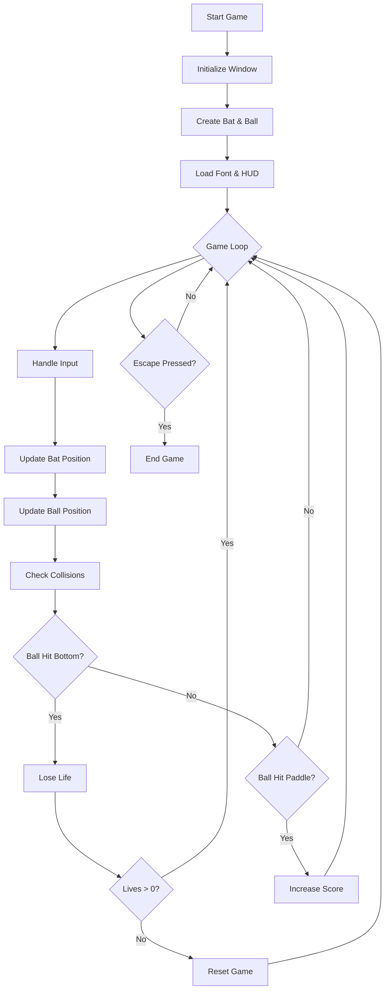

# C++ Pong Game

A classic Pong game implementation using C++ and SFML graphics library.

## Overview

This is a modern implementation of the classic Pong arcade game where players control a paddle to hit a ball back and forth. The game features score tracking, lives system, and smooth graphics.

## Features

- Fullscreen gameplay
- Score tracking system
- Lives system (3 lives)
- Digital-style score display
- Smooth paddle movement
- Ball physics with rebounds
- Exit game functionality

## Requirements

- C++ compiler
- SFML Graphics Library
- Digital font (included in font folder)

## Building the Game

To compile the game, use the following command:

```bash
g++ Bat.cpp Ball.cpp Pong.cpp -lsfml-graphics -lsfml-window -lsfml-system
```

## Controls

- **Left Arrow**: Move paddle left
- **Right Arrow**: Move paddle right
- **Escape**: Exit game

## Game Flow Chart



## Game Components

### Classes

1. **Bat Class**
   - Controls paddle movement
   - Handles collision boundaries
   - Manages paddle speed and position

2. **Ball Class**
   - Controls ball movement
   - Handles collision physics
   - Manages ball speed and direction

## Score System

- Score increases when:
  - Ball hits the paddle
  - Ball hits the top of the screen
- Lives decrease when ball hits bottom
- Game resets when all lives are lost

## File Structure

```
pong-game/
├── src/
│   ├── Ball.cpp
│   ├── Ball.h
│   ├── Bat.cpp
│   ├── Bat.h
│   └── Pong.cpp
├── font/
│   └── DS-DIGI.TTF
└── README.md
```

## License

This project is licensed under the Apache License 2.0 - see the LICENSE file for details.